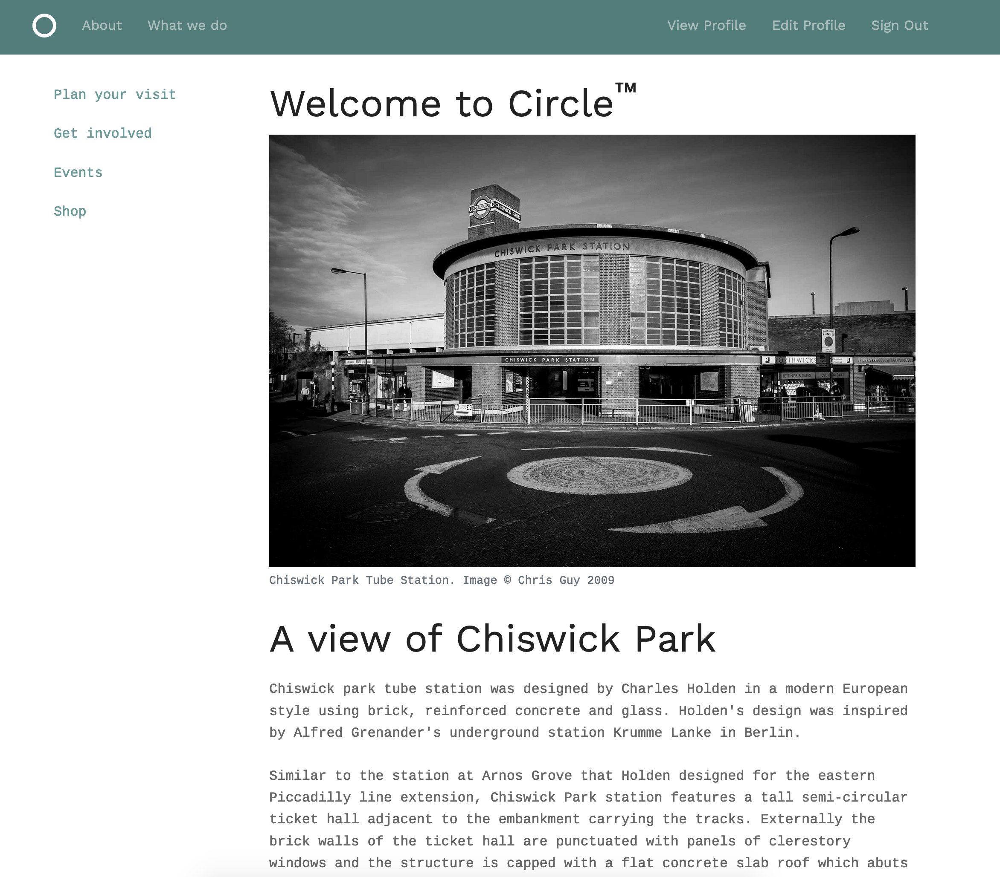
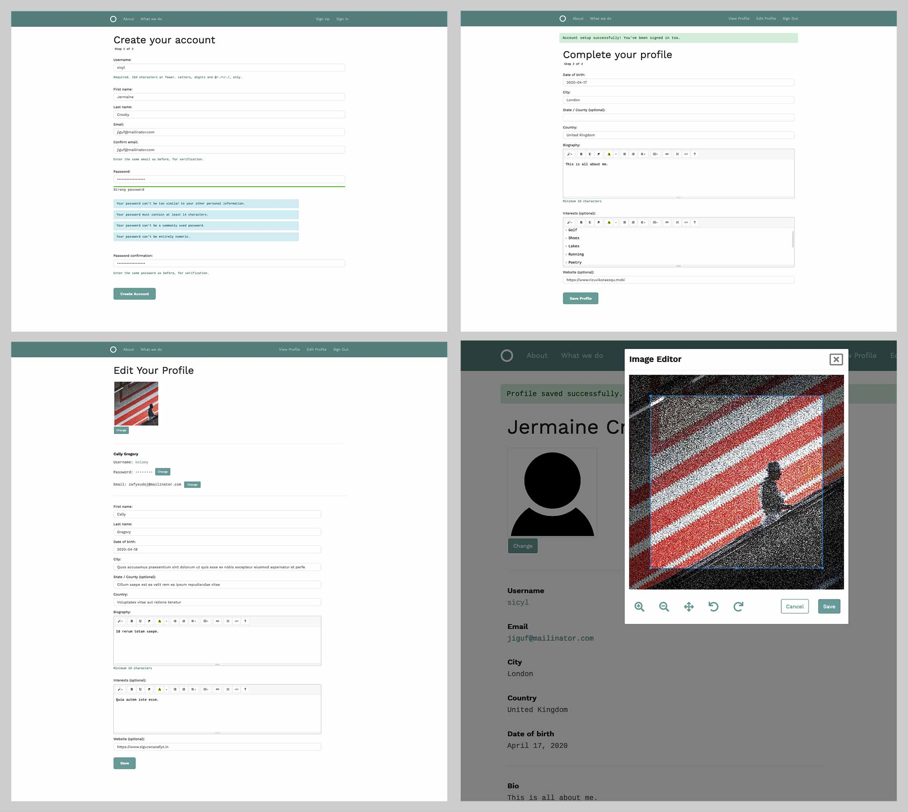

# User Profile with Django





## Description

A user profile app which includes the following features:

* Extended user profile information
* WYSIWYG editor for test formatting
* Drop-down date picker
* Online image editor for avatar editing
* Password strength meter


## Running Locally

```bash
git clone https://github.com/gidsey/project_07_D2.2.git
```

```bash
pip install -r requirements.txt
```
  
```bash
 python manage.py migrate
```

```bash
 python manage.py runserver
```


## Requirments
The project has been updated to run on Django 2.24. 
See `requirements.txt` for full details of the updated project dependencies.


## Styling
The project uses Bootstrap 4 for form and presentation styling.


## Tests
The project includes unit tests which cover:

* Anonymous users access denied to restriced areas
* User creation
* Template usage for all URLs
* Chamge Password form
* Profile form

These tests can be found in `tests.py`.


## Known issues

The jQuery password strength meter does not validate the password to the same standard as the 
server-side form validation. As a result a password marked as 'Strong' by the password strength
meter can still fail the strict form vaildation. 


## Attributions
Icon: person by Guilherme Furtado from [the Noun Project](https://thenounproject.com/).

WYSIWYG Editor by [Summernote](https://summernote.org/)

Date Picker by [Fengyuan Chen](https://fengyuanchen.github.io/datepicker/) 

Password Strength Meter by [Òscar Casajuana](https://github.com/elboletaire/password-strength-meter) 

Image editor based on a tutorial by [Vitor Freitas](https://simpleisbetterthancomplex.com/tutorial/2017/03/02/how-to-crop-images-in-a-django-application.html)

Original photography by [Gidsey](https://gidsey.com)
 
_Project built by [Chris Guy](https://www.linkedin.com/in/gidsey/), September 2019_

